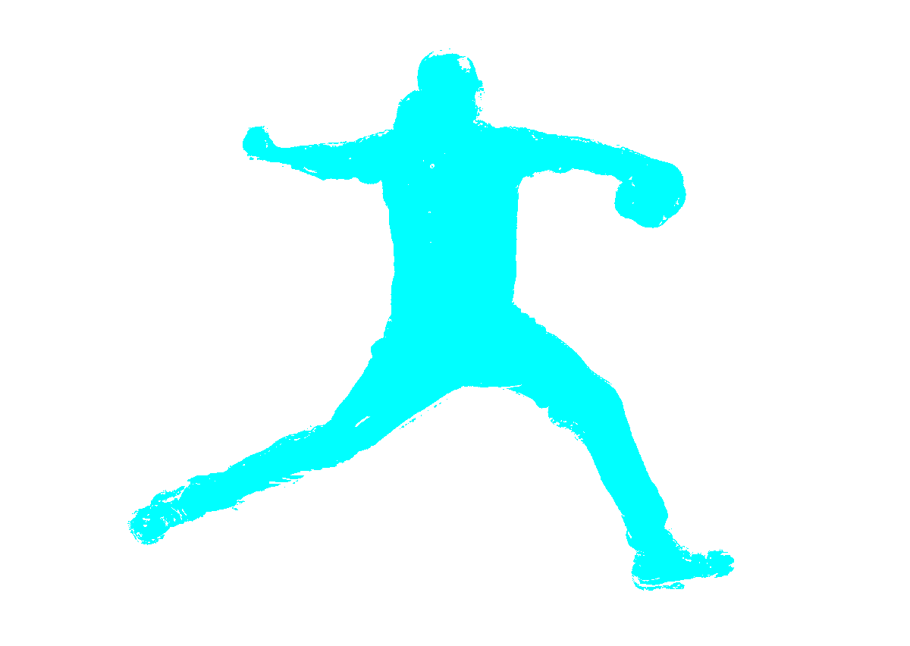

# Preferred Networks インターンシップ 2021 テーマ別課題

選択課題: JP01

## Start

```sh
yarn start
```

## Note

- アノテーションされた画像は`<image_name>.annotation.png`で保存される。
- カーソル上の pixel の色情報と比較して類似色のみを塗る(RGB 値での比較)。

## Demo



